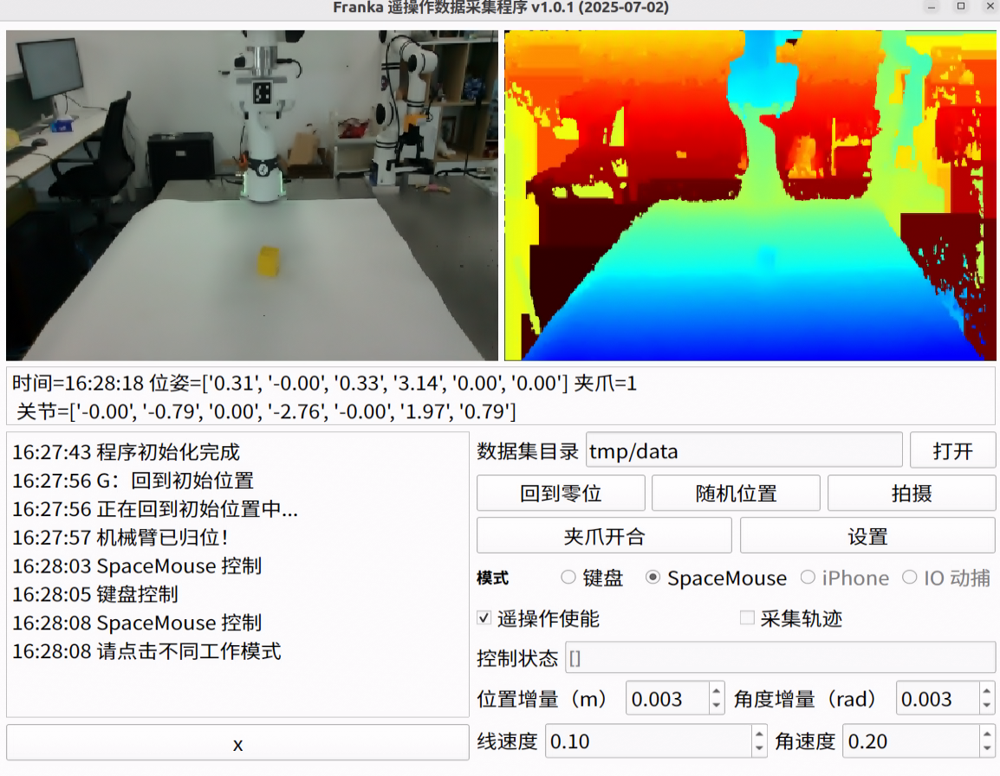

# Franka 遥操作数据采集程序

- 机械臂：Franka Research 3
- 摄像头：Realsense、Orbbec
- 后端：`franka_server`

## 主界面



## 环境配置

```sh
# 1、安装工具箱
pip install ./wk_robot_toolbox-*.tar.gz

# 2、安装依赖
pip install -r requirements.txt

# 3、启动主程序
python -m franka_teleop
```
